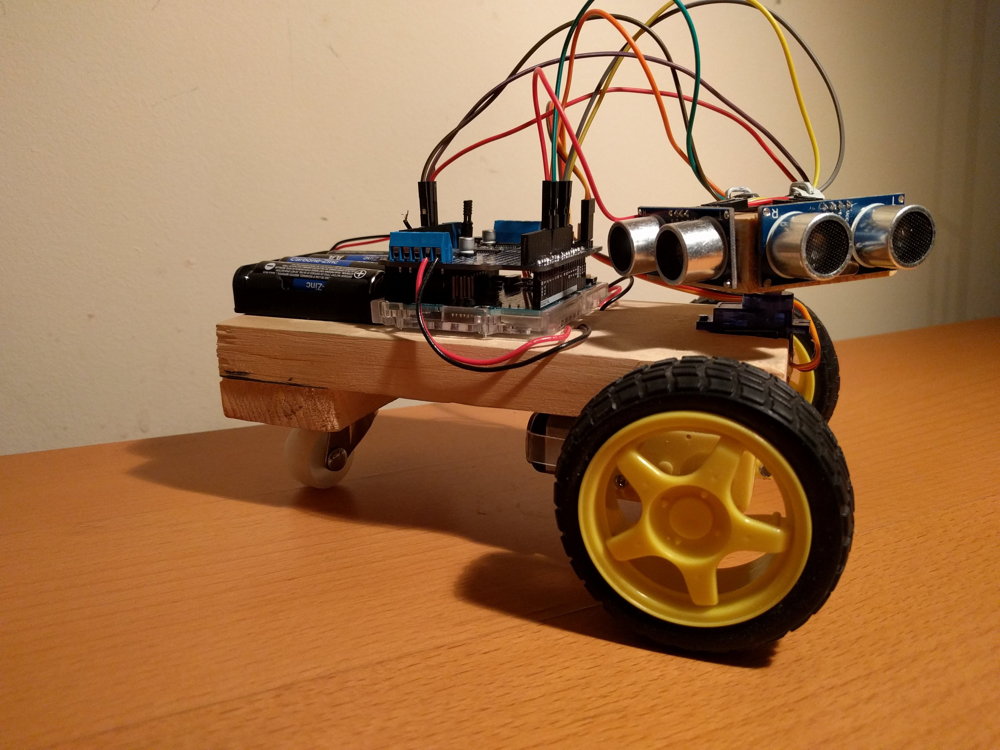
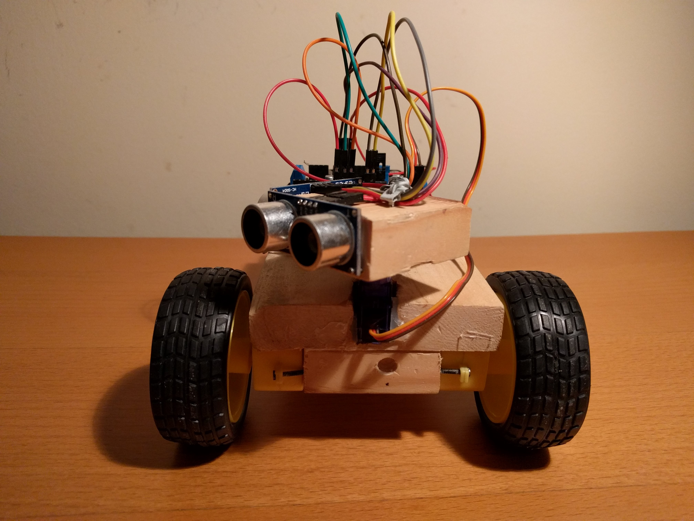
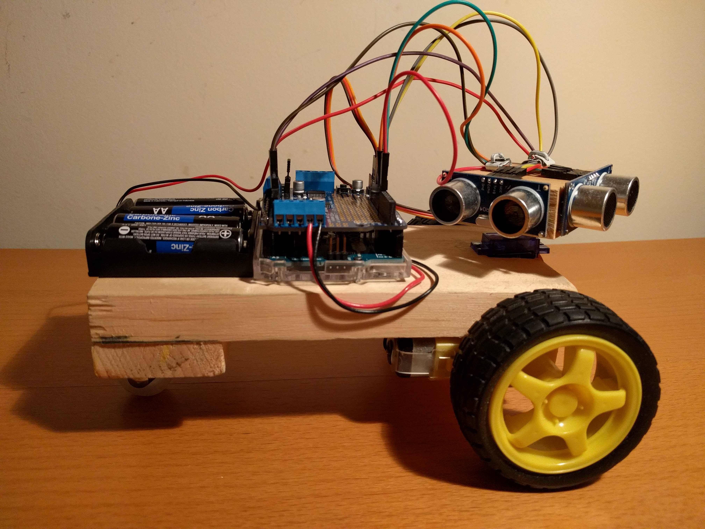
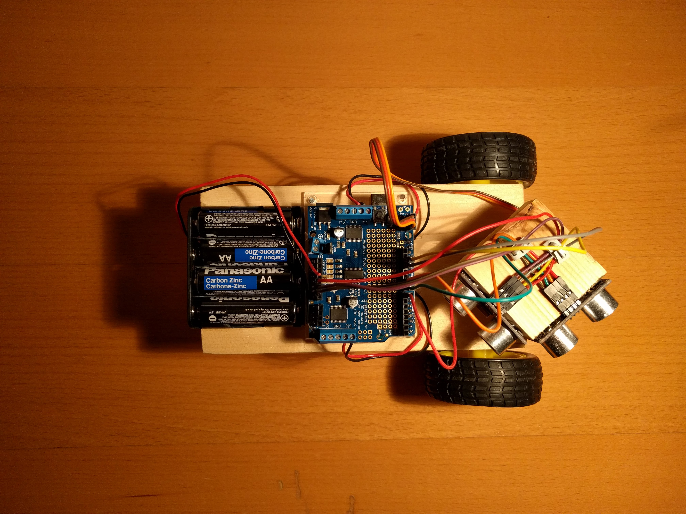

# Meet Indy!

Indy is a 605 gram, 19.5 cm long robot designed to be the perfect wall-following machine. At its heart, the robot uses an arduino to perform PID control, allowing it to track walls smoothly. Indy's two ultrasonic sensors rotate around it's neck, letting it follow walls on its left or right while keeping an eye out ahead.

It's a little messy right now- once development is complete, I'll trim the wires to clean the robot up.

Front View              |Side View                 |Top View
:----------------------:|:------------------------:|:---------------------------------:
  |    |    

Indy is made from an Arduino Uno, Adafruit Motor Shield V2, 2 DC motors, 1 servo motor, 2 ultrasonic sensors and a battery pack. It's body is constructed from 3/4 inch thick birch wood plank, hammered together with the finest carpenter's nails available.

Video coming soon!